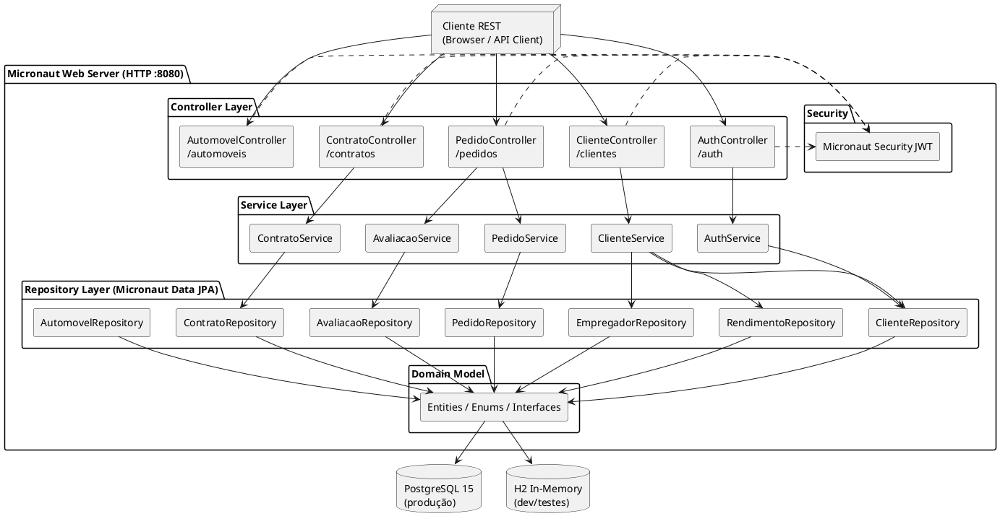

# Sistema de Aluguel de Carros

> **LAB02 — Laboratório de Desenvolvimento de Software**  
> PUC Minas · Engenharia de Software · Prof. João Paulo Carneiro Aramuni

[](https://www.oracle.com/java/)
[](https://micronaut.io/)
[](https://www.postgresql.org/)
[](https://gradle.org/)
[](LICENSE)

---

## Sumário

- [Sobre o Projeto](#-sobre-o-projeto)
- [Arquitetura](#-arquitetura)
- [Modelo de Domínio](#-modelo-de-domínio)
- [Estrutura do Projeto](#-estrutura-do-projeto)
- [Pré-requisitos](#-pré-requisitos)
- [Instalação e Execução](#-instalação-e-execução)
- [Endpoints da API](#-endpoints-da-api)
- [Sprints e Entregas](#-sprints-e-entregas)
- [Modelos UML](#-modelos-uml)
- [Tecnologias](#-tecnologias)
- [Equipe](#-equipe)

---

## Sobre o Projeto

Sistema web para apoio à **gestão de aluguéis de automóveis**, permitindo efetuar, cancelar e modificar pedidos através da Internet.

### Funcionalidades Principais

| Ator | Funcionalidades |
|------|----------------|
| **Cliente** | Cadastro, login, criar/consultar/cancelar pedidos de aluguel, visualizar status e custo estimado |
| **Agente (Empresa)** | Login, avaliar pedidos (aprovar/rejeitar com justificativa), gerenciar frota de veículos (CRUD) |
| **Agente (Banco)** | Login, avaliar pedidos, associar contratos de crédito (modelo extensível) |
| **Sistema** | Cálculo automático do valor estimado (dias × preço diária), geração automática de contratos |

### Regras de Negócio

- O sistema só pode ser utilizado após cadastro prévio
- **Clientes** autenticam com `ROLE_CLIENTE` e são redirecionados ao Dashboard do cliente
- **Agentes (Empresas)** autenticam com `ROLE_AGENTE` e são redirecionados ao Painel Administrativo
- Pedidos seguem o ciclo: `PENDENTE → APROVADO/REJEITADO → (contrato gerado)` | `CANCELADO`
- `valorEstimado` = dias do período × `precoDiaria` do automóvel (calculado pelo servidor)
- Automóveis podem ser propriedade de **Clientes, Empresas ou Bancos**

---

## Arquitetura

O sistema segue a arquitetura **MVC (Model-View-Controller)** com o framework **Micronaut**, organizado em camadas com dependências unidirecionais:

```
┌─────────────────────────────────────────────────────────┐
│                    CLIENT (Browser / REST)                │
└──────────────────────────┬──────────────────────────────┘
                           │ HTTP
┌──────────────────────────▼──────────────────────────────┐
│                    CONTROLLER LAYER                       │
│         @Controller  (Micronaut HTTP Server)              │
│   ClienteController │ PedidoController │ ContratoCtrl    │
└──────────────────────────┬──────────────────────────────┘
                           │ invoca
┌──────────────────────────▼──────────────────────────────┐
│                     SERVICE LAYER                         │
│              @Singleton (Injeção de Dependência)          │
│    ClienteService │ PedidoService │ AvaliacaoService      │
└──────────────────────────┬──────────────────────────────┘
                           │ persiste via
┌──────────────────────────▼──────────────────────────────┐
│                   REPOSITORY LAYER                        │
│           Micronaut Data (JPA / Hibernate)                │
│  ClienteRepository │ PedidoRepository │ ContratoRepo      │
└──────────────────────────┬──────────────────────────────┘
                           │
┌──────────────────────────▼──────────────────────────────┐
│                     DOMAIN MODEL                          │
│   Usuario │ Cliente │ Agente │ Pedido │ Contrato │ ...   │
└──────────────────────────┬──────────────────────────────┘
                           │
┌──────────────────────────▼──────────────────────────────┐
│                      DATABASE                             │
│              PostgreSQL (prod) │ H2 (dev/test)           │
└─────────────────────────────────────────────────────────┘
```

---

## Modelo de Domínio

### Hierarquia de Classes

```
Usuario (abstract)
└── Cliente  implements Proprietario

Agente (abstract)
├── Empresa  implements Proprietario
└── Banco    implements Proprietario

<<interface>> Proprietario
  + getTipoProprietario(): String
  + getDocumento(): String
```

### Entidades Principais

```
Pedido                Contrato              ContratoCredito
├── idPedido          ├── idContrato        ├── idContratoCredito
├── dataCriacao       ├── dataAssinatura    ├── valorCredito
├── dataInicio        ├── dataInicio        └── parcelas
├── dataFim           ├── dataFim
├── status            ├── assinado
└── valorEstimado     └── valorFinal

Automovel             Avaliacao
├── idAutomovel       ├── idAvaliacao
├── matricula         ├── dataAvaliacao
├── ano               ├── parecer
├── marca             └── justificativa
├── modelo
└── placa
```

### Enum `StatusPedido`

```java
public enum StatusPedido {
    PENDENTE,    // Aguardando avaliação do agente
    APROVADO,    // Aprovado — contrato sendo gerado
    REJEITADO,   // Reprovado na análise financeira
    CANCELADO    // Cancelado pelo cliente
}
```

---

## Estrutura do Projeto

```
aluguel-carros/
├── src/
│   ├── main/
│   │   ├── java/br/com/pucminas/aluguelcarros/
│   │   │   ├── domain/
│   │   │   │   ├── model/           # Entidades JPA
│   │   │   │   │   ├── Usuario.java
│   │   │   │   │   ├── Cliente.java
│   │   │   │   │   ├── Agente.java
│   │   │   │   │   ├── Empresa.java
│   │   │   │   │   ├── Banco.java
│   │   │   │   │   ├── Pedido.java
│   │   │   │   │   ├── Contrato.java
│   │   │   │   │   ├── ContratoCredito.java
│   │   │   │   │   ├── Automovel.java
│   │   │   │   │   ├── Rendimento.java
│   │   │   │   │   ├── Empregador.java
│   │   │   │   │   └── Avaliacao.java
│   │   │   │   ├── enums/
│   │   │   │   │   └── StatusPedido.java
│   │   │   │   └── interfaces/
│   │   │   │       └── Proprietario.java
│   │   │   ├── repository/          # Micronaut Data repositories
│   │   │   ├── service/             # Regras de negócio (@Singleton)
│   │   │   ├── controller/          # Endpoints REST (@Controller)
│   │   │   ├── dto/                 # Data Transfer Objects
│   │   │   ├── config/              # Configurações Micronaut
│   │   │   └── exception/           # Exceções customizadas
│   │   └── resources/
│   │       └── application.yml      # Configuração da aplicação
│   └── test/
│       └── java/br/com/pucminas/aluguelcarros/
│           ├── service/             # Testes unitários
│           └── controller/          # Testes de integração
├── docs/
│   └── uml/                         # Diagramas UML (Sprint 01, 02, 03)
├── build.gradle
└── README.md
```

---

## Pré-requisitos

Certifique-se de ter instalado:

- **Java 21+** — [Download JDK](https://adoptium.net/)
- **Gradle 8+** — incluído via Gradle Wrapper (`./gradlew`)
- **PostgreSQL 15+** — para ambiente de produção (desenvolvimento usa H2 em memória, sem necessidade de banco externo)

Verifique as versões:

```bash
java -version    # deve ser 21+
./gradlew --version
```

---

## Instalação e Execução

### 1. Clone o repositório

```bash
git clone https://github.com/seu-usuario/aluguel-carros.git
cd aluguel-carros
```

### 2. Configure o banco de dados

**Opção A — Docker (recomendado para dev):**

```bash
docker run --name aluguel-db \
  -e POSTGRES_DB=aluguelcarros \
  -e POSTGRES_USER=postgres \
  -e POSTGRES_PASSWORD=postgres \
  -p 5432:5432 \
  -d postgres:15
```

**Opção B — PostgreSQL local:**

```sql
CREATE DATABASE aluguelcarros;
CREATE USER postgres WITH PASSWORD 'postgres';
GRANT ALL PRIVILEGES ON DATABASE aluguelcarros TO postgres;
```

### 3. Configure o `application.yml`

```yaml
# src/main/resources/application.yml
datasources:
  default:
    url: jdbc:postgresql://localhost:5432/aluguelcarros
    username: postgres
    password: postgres
    driver-class-name: org.postgresql.Driver

jpa:
  default:
    properties:
      hibernate:
        hbm2ddl:
          auto: update
        dialect: org.hibernate.dialect.PostgreSQLDialect
```

> Para ambiente de **desenvolvimento**, use H2 em memória:
> ```yaml
> datasources:
>   default:
>     url: jdbc:h2:mem:devDb
>     driver-class-name: org.h2.Driver
> ```

### 4. Execute a aplicação

```bash
# Build e execução
./gradlew run

# Ou com hot reload
./gradlew run --continuous
```

A API estará disponível em: **`http://localhost:8080`**

### 5. Execute os testes

```bash
./gradlew test

# Com relatório de cobertura
./gradlew test jacocoTestReport
```

---

## Endpoints da API

### Autenticação

| Método | Endpoint | Acesso | Descrição |
|--------|----------|--------|-----------|
| `POST` | `/auth/register` | Público | Cadastro de novo cliente |
| `POST` | `/login` | Público | Login e obtenção de token JWT |

### Clientes

| Método | Endpoint | Acesso | Descrição |
|--------|----------|--------|-----------|
| `GET` | `/clientes/{id}` | Autenticado | Buscar cliente por ID |
| `PUT` | `/clientes/{id}` | Autenticado | Atualizar dados do cliente |

### Pedidos

| Método | Endpoint | Acesso | Descrição |
|--------|----------|--------|-----------|
| `POST` | `/pedidos` | `ROLE_CLIENTE` | Criar pedido (valor calculado automaticamente) |
| `GET` | `/pedidos` | `ROLE_CLIENTE` | Listar pedidos do cliente autenticado |
| `GET` | `/pedidos/{id}` | Autenticado | Detalhar pedido |
| `DELETE` | `/pedidos/{id}` | `ROLE_CLIENTE` | Cancelar pedido (somente PENDENTE) |
| `GET` | `/pedidos/pendentes` | `ROLE_AGENTE` | Listar todos os pedidos pendentes |

### Avaliações (Agentes)

| Método | Endpoint | Acesso | Descrição |
|--------|----------|--------|-----------|
| `POST` | `/avaliacoes/{idPedido}` | `ROLE_AGENTE` | Aprovar ou rejeitar pedido + gerar contrato |

### Automóveis

| Método | Endpoint | Acesso | Descrição |
|--------|----------|--------|-----------|
| `GET` | `/automoveis` | Autenticado | Listar veículos disponíveis |
| `GET` | `/automoveis/{id}` | Autenticado | Detalhar veículo |
| `GET` | `/automoveis/meus` | `ROLE_AGENTE` | Listar frota da empresa autenticada |
| `POST` | `/automoveis` | `ROLE_AGENTE` | Cadastrar novo veículo na frota |
| `PUT` | `/automoveis/{id}/disponibilidade` | `ROLE_AGENTE` | Alternar disponibilidade do veículo |
| `DELETE` | `/automoveis/{id}` | `ROLE_AGENTE` | Remover veículo da frota |

### Contratos

| Método | Endpoint | Acesso | Descrição |
|--------|----------|--------|-----------|
| `GET` | `/contratos/{id}` | Autenticado | Detalhar contrato |

---

## Sprints e Entregas

### Sprint 01 — Modelagem

> **Entregues:**

- [x] Diagrama de Casos de Uso (12 UCs identificados)
- [x] Histórias do Usuário (9 histórias em 4 épicos com critérios de aceitação)
- [x] Diagrama de Classes (com melhorias: `Avaliacao`, atributos temporais, métodos em `Proprietario`)
- [x] Diagrama de Pacotes — Visão Lógica (9 pacotes, arquitetura MVC Micronaut)

Documentação: [`/docs/uml/Sprint01_Modelagem.docx`](docs/uml/)

---

### Sprint 02 — Componentes + CRUD Cliente

> **Entregues:**

- [x] Revisão dos diagramas (feedback Sprint 01 — sem alterações necessárias)
- [x] Diagrama de Componentes do Sistema ([`/docs/uml/diagrama-componentes.puml`](docs/uml/diagrama-componentes.puml))
- [x] Implementação do CRUD completo de Cliente (Micronaut + JPA)
- [x] Autenticação JWT com Micronaut Security

---

### Sprint 03 — Protótipo Final ✅

> **Entregues:**

- [x] Interface Web completa (SPA multi-role: Cliente e Agente)
- [x] Autenticação JWT com emissão dinâmica de Roles (`ROLE_CLIENTE` / `ROLE_AGENTE`)
- [x] Roteamento automático por Role pós-login
- [x] Dashboard do Cliente: histórico de pedidos com status e valor calculado
- [x] Dashboard Administrativo: avaliação de pedidos e CRUD de frota de veículos
- [x] Cálculo automático de `valorEstimado` (dias × preço diário do veículo)
- [x] Geração automática de Contrato ao aprovar pedido
- [x] Diagrama de Implantação ([`/docs/uml/diagrama-implantacao.puml`](docs/uml/diagrama-implantacao.puml))
- [x] Suíte de testes JUnit 5 + Mockito

---

## Modelos UML

Os diagramas estão na pasta [`/docs/uml/`](docs/uml/) como arquivos PlantUML (`.puml`) versionáveis.

### Diagrama de Casos de Uso


### Diagrama de Classes


### Diagrama de Pacotes


### Diagrama de Componentes *(Sprint 02)*


---

---

### Código-fonte PlantUML

### Diagrama de Casos de Uso — PlantUML

```plantuml
@startuml
left to right direction
skinparam actorStyle awesome

actor Cliente
actor Agente
actor Empresa extends Agente
actor Banco extends Agente
actor Sistema

rectangle "Sistema de Aluguel de Carros" {
  (UC01) as "Realizar Cadastro"
  (UC02) as "Realizar Login"
  (UC03) as "Criar Pedido"
  (UC04) as "Consultar Pedido"
  (UC05) as "Modificar Pedido"
  (UC06) as "Cancelar Pedido"
  (UC07) as "Avaliar Pedido"
  (UC08) as "Gerar Contrato"
  (UC09) as "Associar Crédito"
}

Cliente --> (UC01)
Cliente --> (UC02)
Cliente --> (UC03)
Cliente --> (UC04)
Agente  --> (UC07)
Banco   --> (UC09)
Sistema --> (UC08)

(UC03) ..> (UC02) : <<include>>
(UC08) ..> (UC07) : <<include>>
@enduml
```

### Diagrama de Classes — PlantUML

```plantuml
@startuml
skinparam classAttributeIconSize 0

enum StatusPedido { PENDENTE; APROVADO; REJEITADO; CANCELADO }

interface Proprietario {
  +getTipoProprietario(): String
  +getDocumento(): String
}

abstract class Usuario {
  -idUsuario: Long
  -nome: String
  -login: String
  -senha: String
  -endereco: String
}

class Cliente {
  -cpf: String
  -rg: String
  -profissao: String
}
Cliente --|> Usuario
Cliente ..|> Proprietario

abstract class Agente { -cnpj: String }
class Empresa { -razaoSocial: String }
class Banco { -nomeBanco: String; -codigoBancario: String }
Empresa --|> Agente
Banco   --|> Agente
Empresa ..|> Proprietario
Banco   ..|> Proprietario

class Pedido {
  -idPedido: Long
  -dataCriacao: Date
  -dataInicioAluguel: Date
  -dataFimAluguel: Date
  -status: StatusPedido
  -valorEstimado: Double
}

class Avaliacao {
  -dataAvaliacao: Date
  -parecer: String
  -justificativa: String
}

Cliente "1" --> "0..*" Pedido
Pedido  "1" --> "0..1" Contrato
Agente  "1" --> "*"    Avaliacao
Pedido  "1" --> "*"    Avaliacao
@enduml
```

### Diagrama de Componentes — PlantUML *(Sprint 02)*



---

## Tecnologias

| Tecnologia | Versão | Uso |
|-----------|--------|-----|
| **Java** | 21 | Linguagem principal |
| **Micronaut** | 4.x | Framework web e IoC |
| **Micronaut Data** | 4.x | ORM / repositórios JPA |
| **Hibernate** | 6.x | Provider JPA |
| **PostgreSQL** | 15 | Banco de dados produção |
| **H2** | 2.x | Banco de dados desenvolvimento/testes |
| **Micronaut Security** | 4.x | Autenticação JWT + RBAC |
| **BCrypt** | — | Hash de senhas |
| **Gradle** | 8.x | Build tool |
| **JUnit 5** | 5.x | Testes unitários |
| **Mockito** | 5.x | Mocks para testes |

---

## Equipe

| Nome | Função | GitHub |
|------|--------|--------|
| [Arthur Capanema Bretas] | Desenvolvedor | [arthurcbretas@gmail.com) |

---

## Licença

Este projeto está licenciado sob a [MIT License](LICENSE).

---

<div align="center">

**PUC Minas · Engenharia de Software · 2026**  
Laboratório de Desenvolvimento de Software — LAB02

</div>
